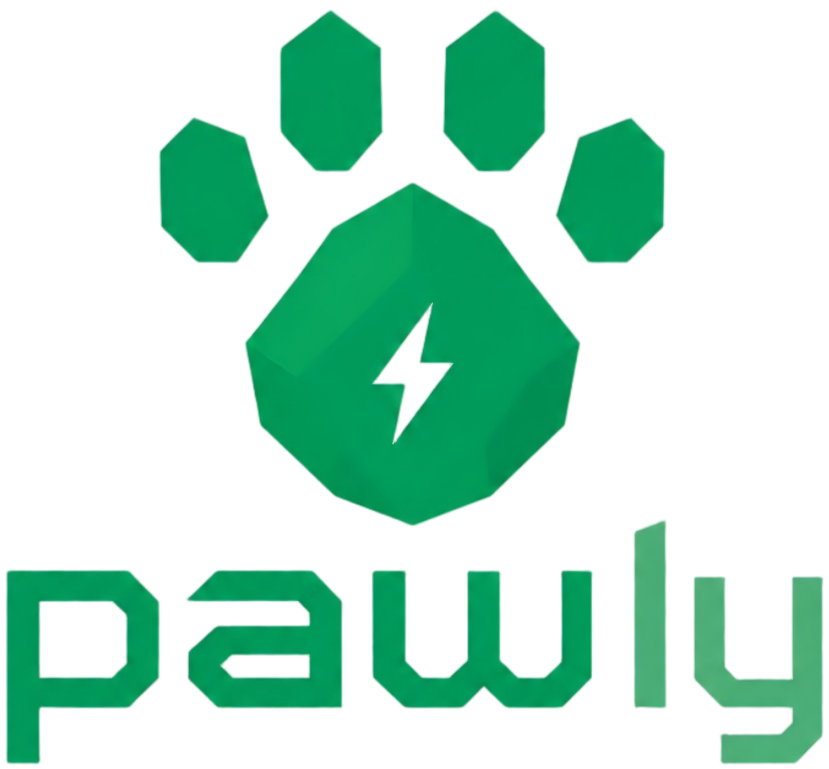

# Pawly

<p align="center">
  
</p>

<p align="center">
  <strong>Managed, safe execution for AI agent actions.</strong>
</p>

Pawly takes over the messy part of agent execution: deciding which capability
should run, checking whether it is allowed, wrapping the call in a policy-aware
execution path, and returning a receipt you can debug or audit later. It is built
for the moment an agent is about to touch the outside world: send an email,
publish content, issue a refund, update a record, call an API, or trigger a
payment.

Instead of wiring every tool call, permission rule, fallback, and audit record by
hand, your agent delegates a goal to Pawly. Pawly manages the execution path so
your agent can act without quietly doing something unsafe, unauthorized, or
impossible to reconstruct later.

```python
from pawly import Pawly

# Register skills before executing a goal. See Quickstart for a complete example.
pawly = Pawly("./worker.yaml")
result = pawly.achieve(
    objective="safe reply to the duplicate charge question",
    context={"order_id": "123"},
    constraints={"max_cost": 2},
)
```

Pawly is not another agent framework. It is the safety and execution layer you
put behind one: your agent decides what it wants, Pawly manages how that action
is allowed to run.

## Status

Pawly is in alpha. The goal interface, Pawprint boundary model, and local
execution receipts are the primary stable surfaces. Lower-level adapter and
gateway APIs may continue to evolve.

## Why Pawly

Building agent products gets painful and risky right after the demo works. You
start with tool calls, then quickly need routing, permission checks, blocked
actions, review paths, audit logs, reproducible receipts, and framework adapters.
The hardest bugs are not syntax errors; they are agents calling the wrong tool,
acting outside their scope, or leaving no useful trace when something goes wrong.

Pawly packages that execution work into a small runtime:

- **Stop hand-rolling tool routing.** Delegate an objective and let Pawly map it
  to a registered capability.
- **Make external actions safer.** Put policy checks before calls that can email,
  publish, refund, delete, pay, or modify user data.
- **Keep permissions out of prompt glue.** Declare allowed, review-only, and
  blocked capabilities in Pawprint instead of relying on model instructions.
- **Make execution inspectable.** Every goal attempt can return an action receipt
  with the selected capability and execution envelope.
- **Keep your existing framework.** Insert Pawly before the tool or skill
  executor instead of rebuilding your agent loop.
- **Run locally first.** Use deterministic OSS policy checks offline, then move
  cloud-only planning and governance to the hosted platform when needed.

## Core Concepts

| Concept | Meaning |
| --- | --- |
| Pawprint | The YAML contract that declares metadata, capabilities, and boundaries. |
| Capability | A named action the agent may ask Pawly to use. |
| Skill | Local Python code registered to implement a capability. |
| Objective | The goal delegated by the agent runtime. |
| Execution envelope | The scoped runtime boundary for a goal: resources, capabilities, limits, and approvals. |
| Action receipt | The auditable result of a goal attempt. |

## Install

From PyPI, after release:

```bash
pip install pawly
```

From GitHub:

```bash
pip install "git+https://github.com/dustin-aploy/pawprint.git"
pip install "git+https://github.com/dustin-aploy/open_pawly.git" --no-deps
```

From source:

```bash
git clone git@github.com:dustin-aploy/open_pawly.git
cd open_pawly
pip install -e ../pawprint
pip install --no-build-isolation --no-deps -e ".[dev]"
```

The PyPI package dependency is `pawly-pawprint`. Do not install the unrelated
package named `pawprint`.

## Quickstart

Create `worker.yaml`:

```yaml
metadata:
  id: support-worker
  name: Support Worker
  description: Local support action boundary.

capabilities:
  - name: safe_reply
    description: Send a low-risk support reply.
  - name: issue_refund
    description: Refund a customer order.

boundaries:
  allow:
    - safe_reply
  review: []
  block:
    - issue_refund
```

Validate it:

```bash
python -m pawprint.validate ./worker.yaml
```

Register a skill and delegate a goal:

```python
from pawly import HeuristicPolicy, Pawly, SkillRegistry

pawly = Pawly("./worker.yaml", scoring_policy=HeuristicPolicy())

skills = SkillRegistry()
skills.register(
    "safe_reply",
    lambda args, context: {
        "message": "We checked your order and will follow up safely.",
        "objective": args["objective"],
        "order_id": context.get("order_id"),
    },
)
pawly.register_skills(skills)

result = pawly.achieve(
    objective="safe reply to the duplicate charge question",
    context={"order_id": "123", "channel": "chat"},
    constraints={"max_cost": 2},
)

print(result.status)
print(result.result)
print(result.action_receipt["execution_envelope"])
```

## Public API

The recommended integration surface is goal-oriented:

```python
Pawly(...).achieve(objective=..., context=..., constraints=...)
```

Lower-level APIs are available for adapters and migration work:

| API | Use when |
| --- | --- |
| `achieve(...)` | You want the top-level helper around `Pawly(...).achieve(...)`. |
| `DecisionEngine.run_actions(...)` | You already have explicit `Action` objects. |
| `run_actions(...)` | You want the top-level explicit-action helper. |
| `decide(...)` | You only need decision output, not execution. |
| `run(...)` | You need the legacy task/action evaluation helper. |
| `wrap_*` adapters | You are inserting Pawly into an existing tool executor. |

## Receipts

`achieve(...)` returns `GoalExecutionResult`.

```python
{
    "status": "completed",
    "objective": "safe reply to the duplicate charge question",
    "selected_capability": "safe_reply",
    "execution_envelope": {
        "resource_scope": {"order_id": "123", "channel": "chat"},
        "allowed_capabilities": ["safe_reply"],
        "financial_limits": {"max_cost": 2},
        "execution_limits": {},
        "approval_policy": {},
    },
}
```

Common statuses:

| Status | Meaning |
| --- | --- |
| `completed` | A matching local skill ran successfully. |
| `unsupported_goal` | No registered skill matched the delegated objective. |
| `accepted` | Cloud-style project input was accepted without local execution. |
| `failed` | Local execution failed or was blocked. |

## Architecture

Pawly keeps the core runtime small:

```text
Agent runtime
    |
    | objective + context + constraints
    v
Pawly
    |-- Pawprint boundary
    |-- Skill registry
    |-- Policy engine
    |-- Execution gateway
    v
Local skill executor
```

The package intentionally has no dependency on `pawly-cloud`. Hosted planning,
credential brokering, marketplace access, and organization governance are cloud
features, not OSS runtime requirements.

## Adapters

Pawly can be inserted at the point where an existing framework is about to run a
tool, transition, or skill:

- OpenAI Agents
- Claude Skills
- LangGraph
- CrewAI
- OpenClaw-style loops
- self-hosted HTTP workers

See [`src/pawly/adapters/README.md`](src/pawly/adapters/README.md) and
[`adapters/`](adapters/).

## Documentation

- [Architecture](docs/architecture.md)
- [Execution gateway](docs/execution_gateway.md)
- [Run actions](docs/run_actions.md)
- [Approval flow](docs/approval_flow.md)
- [Audit and replay](docs/audit_and_replay.md)
- [Pawprint policy engine](docs/pawprint_policy_engine.md)
- [Protected skills](docs/protected_skills.md)
- [OSS vs Cloud](docs/oss_vs_cloud.md)
- [Project status](docs/status.md)

## Development

```bash
pip install -e ../pawprint
pip install --no-build-isolation --no-deps -e ".[dev]"
python -m pytest
```

Focused smoke tests:

```bash
python -m pytest tests/test_goal_interface.py tests/test_run_actions.py tests/test_runtime_smoke.py
```

## Contributing

Issues and pull requests are welcome. For code changes, include focused tests and
keep cloud-only behavior out of the OSS runtime. If a change affects the
Pawprint contract, update the sibling `pawprint` package and relevant docs in
the same patch.

## Repository Layout

```text
src/pawly/       core runtime package
examples/        runnable examples
docs/            architecture and runtime notes
tests/           package tests
test-suite/      local conformance suite
adapters/        adapter docs and stubs
scripts/         bootstrap and smoke-test helpers
```

## License

Apache-2.0. See [LICENSE](LICENSE).
