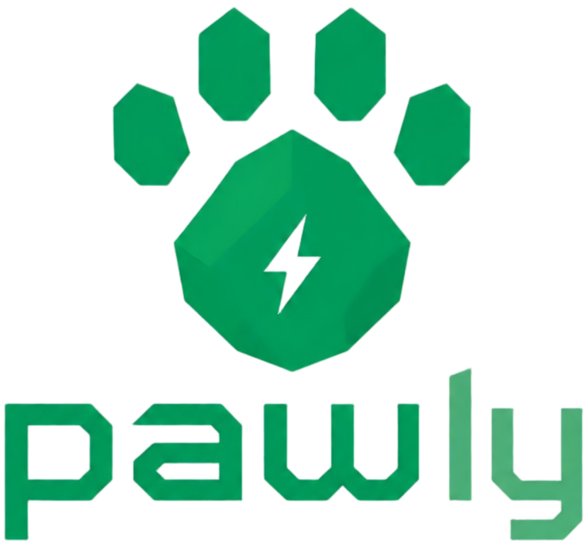

# Pawly

<p align="center">
  
</p>

<p align="center">
  <strong>Managed, safe execution for AI agent actions.</strong>
</p>

Pawly takes over the messy part of agent execution: deciding which capability
should run, checking whether it is allowed, wrapping the call in a policy-aware
execution path, and returning a receipt you can debug or audit later. It is built
for the moment an agent is about to touch the outside world: send an email,
publish content, issue a refund, update a record, call an API, or trigger a
payment.

Instead of wiring every tool call, permission rule, fallback, and audit record by
hand, your agent delegates a goal to Pawly. Pawly manages the execution path so
your agent can act without quietly doing something unsafe, unauthorized, or
impossible to reconstruct later.

Pawly is not another agent framework. It is the safety and execution layer you
put behind one: your agent decides what it wants, Pawly manages how that action
is allowed to run.

This repository contains Open Pawly, the local runtime for defining action
boundaries, registering skills, running policy checks, and collecting receipts
before your agent touches external systems.

## Status

Pawly is in alpha. The goal interface, Pawprint boundary model, and local
execution receipts are the primary stable surfaces. Lower-level adapter and
gateway APIs may continue to evolve.

## Why Pawly

Building agent products gets painful and risky right after the demo works. You
start with tool calls, then quickly need routing, permission checks, blocked
actions, review paths, audit logs, reproducible receipts, and framework adapters.
The hardest bugs are not syntax errors; they are agents calling the wrong tool,
acting outside their scope, or leaving no useful trace when something goes wrong.

Pawly packages that execution work into a small runtime:

- **Stop hand-rolling tool routing.** Delegate an objective and let Pawly map it
  to a registered capability.
- **Make external actions safer.** Put policy checks before calls that can email,
  publish, refund, delete, pay, or modify user data.
- **Keep permissions out of prompt glue.** Declare allowed, review-only, and
  blocked capabilities in Pawprint instead of relying on model instructions.
- **Make execution inspectable.** Every goal attempt can return an action receipt
  with the selected capability and execution envelope.
- **Keep your existing framework.** Insert Pawly before the tool or skill
  executor instead of rebuilding your agent loop.
- **Run locally first.** Use deterministic Open Pawly policy checks offline,
  then connect a cloud project when you want managed keys, team review, and
  shared execution history.

## Core Concepts

| Concept | Meaning |
| --- | --- |
| Pawprint | The YAML contract that declares metadata, capabilities, and boundaries. |
| Capability | A named action the agent may ask Pawly to use. |
| Skill | Local Python code registered to implement a capability. |
| Objective | The goal delegated by the agent runtime. |
| Execution envelope | The scoped runtime boundary for a goal: resources, capabilities, limits, and approvals. |
| Action receipt | The auditable result of a goal attempt. |

## Install

From PyPI:

```bash
pip install pawly
```

From GitHub:

```bash
pip install "git+https://github.com/dustin-aploy/pawprint.git"
pip install "git+https://github.com/dustin-aploy/open_pawly.git" --no-deps
```

From source:

```bash
git clone git@github.com:dustin-aploy/open_pawly.git
cd open_pawly
pip install -e ../pawprint
pip install --no-build-isolation --no-deps -e ".[dev]"
```

The PyPI package dependency is `pawly-pawprint`. Do not install the unrelated
package named `pawprint`.

## Quickstart

### 1. Define the agent boundary

Start with the agent, not with a tool wrapper. Create
`agents/support_agent.pawprint.yaml` to describe what this agent is allowed to
do when it reaches the execution layer.

Keep the first version small: one safe action, one review-only action, and one
action that should never run automatically.

```yaml
metadata:
  id: support-agent
  name: Support Agent
  description: Handles routine support requests and keeps risky actions behind review.

capabilities:
  - name: safe_reply
    description: Send a low-risk customer reply that stays within approved guidance.
  - name: lookup_order
    description: Read order status for the current customer.
  - name: issue_refund
    description: Refund a customer account.

boundaries:
  allow:
    - safe_reply
    - lookup_order
  review:
    - issue_refund
  block:
    - delete_customer
```

Validate it:

```bash
python -m pawprint.validate ./agents/support_agent.pawprint.yaml
```

### 2. Put Pawly on the execution path

The main integration is goal-first execution. Your agent runtime keeps planning
and conversation state, but it does not call production tools directly. Register
the real functions behind Pawly, then have your runtime pass the user's goal to
`pawly.achieve(...)`.

This is the important boundary: Pawly is not an optional model tool. It is the
only execution path your app calls when an agent wants to act.

Create `support_agent.py`:

```python
from typing import Any, NotRequired, TypedDict

from pawly import AuditService, HeuristicPolicy, Pawly, PolicyService, SkillService


class AgentPlan(TypedDict):
    objective: str
    context: dict[str, Any]
    constraints: NotRequired[dict[str, Any]]


def lookup_order(args, context):
    return {
        "order_id": context["order_id"],
        "status": "paid",
        "duplicate_charge": True,
    }


def safe_reply(args, context):
    return {
        "message": "We checked your order and will follow up safely.",
        "objective": args["objective"],
        "order_id": context.get("order_id"),
    }


def issue_refund(args, context):
    return {
        "status": "queued_for_refund",
        "order_id": context["order_id"],
    }


pawly = Pawly(
    "./agents/support_agent.pawprint.yaml",
    skills=SkillService.local(
        {
            "lookup_order": lookup_order,
            "safe_reply": safe_reply,
            "issue_refund": issue_refund,
        }
    ),
    policy=PolicyService.local(routing=HeuristicPolicy()),
    audit=AuditService.local("./pawly-audit.jsonl"),
)


class SupportAgentRuntime:
    """The agent owns conversation/planning; Pawly owns execution."""

    def plan(self, user_message, *, order_id, customer_id) -> AgentPlan:
        # In production, this method is usually your framework's structured
        # output call. Keep the same contract: objective, context, constraints.
        normalized = user_message.lower()
        if "refund" in normalized or "charged" in normalized:
            objective = (
                "safe_reply about a billing question; "
                f"do not issue_refund automatically: {user_message}"
            )
            constraints = {"max_refund": 0}
        elif "order" in normalized:
            objective = f"lookup_order and safe_reply for this customer request: {user_message}"
            constraints = {}
        else:
            objective = f"safe_reply for this support request: {user_message}"
            constraints = {}
        return {
            "objective": objective,
            "context": {
                "order_id": order_id,
                "customer_id": customer_id,
                "channel": "chat",
            },
            "constraints": constraints,
        }


agent_runtime = SupportAgentRuntime()
plan = agent_runtime.plan(
    "I was charged twice. Can you refund me?",
    order_id="ord_123",
    customer_id="cus_123",
)
result = pawly.achieve(**plan)

print(result.status)
print(result.result)
print(result.action_receipt)
```

Pawly builds the candidate actions from registered skills, applies the Pawprint
boundaries, scores the eligible actions, executes the selected skill, and returns
a receipt. The receipt shows which capability was selected, which boundary
applied, and what was recorded for audit.

The agent runtime can still use an LLM to understand the conversation and
produce the structured plan. The production credentials stay behind the
registered skill functions, and application code calls `pawly.achieve(...)`
instead of exposing those functions as unguarded model tools.

In an agent framework with structured output, the runtime output is just the
`AgentPlan` shape above. Pass it directly into `pawly.achieve(**plan)` as long as
it contains `objective`, `context`, and optional `constraints`. If the workflow
is deterministic business logic, use the same shape from normal code; Pawly does
not require an LLM.

For Open Pawly local routing, the objective must use the agent's Pawprint
capability language: names such as `safe_reply` or terms from the capability
description such as `read order status`. If the objective is only raw user text,
Pawly may return `unsupported_goal` because it cannot build a safe candidate
set. This is intentional: the runtime should fail closed rather than guess which
production action to run.

The same flow is available as a runnable example:

```bash
python examples/goal_first_support_agent.py
```

That example starts from `examples/agents/goal_first_support_agent.yaml`, binds
the agent's real skills, creates an agent-runtime plan, and routes the support
message through `pawly.achieve`.

At first, a local audit file is usually enough. Cloud becomes useful when the
agent is no longer just your local experiment: teammates need to see what ran,
customers ask why an action happened, approvals need a shared place to live, or
you want to add managed skills without maintaining another tool integration.
Keep the same three service shape and connect only the parts you want to run
through Pawly Cloud. Get a free project API key from
[Pawly Developer](https://developer.aploy.ai/pawly).

```bash
export PAWLY_API_KEY="paste_the_project_key"
```

```python
import os
from pawly import AuditService, HeuristicPolicy, PolicyService, SkillService

api_key = os.getenv("PAWLY_API_KEY")

skills = SkillService.local({"safe_reply": safe_reply})
policy = PolicyService.cloud(api_key=api_key)
audit = AuditService.cloud(api_key=api_key, local_path="./pawly-audit.jsonl")
```

That setup still keeps a local audit file, while the same run can appear in the
project timeline for search, review, and handoff. If the key is missing, Pawly
returns a configuration step with the console link instead of an unclear runtime
failure.

### 3. Connect existing skills

Many agent projects already keep related skills or tools in one folder. Connect
that folder through an adapter so Pawly reads a known format instead of guessing.

```text
skills/
  support.py
  billing.py
```

```python
# skills/support.py
def safe_reply(args, context):
    return {"message": "Handled safely.", "order_id": context.get("order_id")}

skills = {"safe_reply": safe_reply}
```

Replace the `skills=` line:

```python
skills=SkillService.from_directory("./skills", adapter="pawly")
```

Existing framework folders use their own adapters:

```python
skills=SkillService.from_directory("./openai_tools", adapter="openai")
skills=SkillService.from_directory("./claude_skills", adapter="claude")
```

If your framework already creates tool objects in code, pass those directly:

```python
skills=SkillService.from_openai_tools(openai_tools)
```

Cloud uses the same `SkillService` slot. Use it when a skill should be selected,
tested, or managed from the dashboard, or when an existing local skills folder
should be brought into that workflow through an adapter:

```python
skills=SkillService.cloud(
    api_key=os.getenv("PAWLY_API_KEY"),
    directory="./skills",
    adapter="pawly",
)
```

Marketplace skills are selected in the dashboard, so the SDK does not need a
manual skill-id list. Local folders still require an explicit adapter because
Pawly should read a known format instead of guessing.

## Developer API

The developer-facing integration surface is goal-first:

```python
Pawly(...).achieve(objective=..., context=..., constraints=...)
```

Keep real external actions behind `SkillService`; do not expose the same
credentials through unguarded tools. Lower-level candidate-action and executor
wrapper APIs remain in the package for framework adapters, migration work, and
runtime maintainers, but they are not the main developer integration path.

## Receipts

`achieve(...)` returns `GoalExecutionResult`.

```python
{
    "status": "completed",
    "objective": "safe reply to the duplicate charge question",
    "selected_capability": "safe_reply",
    "execution_envelope": {
        "resource_scope": {"order_id": "123", "channel": "chat"},
        "allowed_capabilities": ["safe_reply"],
        "financial_limits": {"max_cost": 2},
        "execution_limits": {},
        "approval_policy": {},
    },
}
```

Common statuses:

| Status | Meaning |
| --- | --- |
| `completed` | A matching local skill ran successfully. |
| `unsupported_goal` | No registered skill matched the delegated objective. |
| `configuration_required` | A Pawprint path or cloud key is missing; the receipt includes the next step. |
| `failed` | Local execution failed or was blocked. |

## Architecture

Pawly keeps the core runtime small:

```text
Agent runtime
    |
    | objective + context + constraints
    v
Pawly
    |-- Pawprint boundary
    |-- Skill registry
    |-- Candidate builder
    |-- Policy routing
    |-- Execution/audit receipt
    v
Local skill executor
```

The package intentionally has no dependency on cloud services. Managed
planning, credential brokering, marketplace access, and organization governance
are optional integrations, not Open Pawly runtime requirements.

## Adapters

Pawly can be inserted at the point where an existing framework is about to run a
tool, transition, or skill:

- OpenAI Agents
- Claude Skills
- LangGraph
- CrewAI
- OpenClaw-style loops
- self-hosted HTTP workers

See [`src/pawly/adapters/README.md`](src/pawly/adapters/README.md) and
[`adapters/`](adapters/).

## Documentation

- [Architecture](docs/architecture.md)
- [Approval flow](docs/approval_flow.md)
- [Audit and replay](docs/audit_and_replay.md)
- [Pawprint policy engine](docs/pawprint_policy_engine.md)
- [Protected skills](docs/protected_skills.md)
- [Project status](docs/status.md)

## Development

```bash
pip install -e ../pawprint
pip install --no-build-isolation --no-deps -e ".[dev]"
python -m pytest
```

Focused smoke tests:

```bash
python -m pytest tests/test_goal_interface.py tests/test_run_actions.py tests/test_runtime_smoke.py
```

## Contributing

Issues and pull requests are welcome. For code changes, include focused tests and
keep cloud-service behavior out of the Open Pawly runtime. If a change affects
the Pawprint contract, update the sibling `pawprint` package and relevant docs
in the same patch.

## Source Layout

Open Pawly is split by runtime responsibility, not by product surface:

```text
src/pawly/
  goal.py             goal-oriented Pawly(...).achieve(...) facade
  services/           public SkillService, PolicyService, and AuditService wiring
  runtime*.py         local decision, execution, receipts, and fallback behavior
  policy*/            local Pawprint policy checks and action scoring
  skill_registry.py   local skill registration and dispatch
  audit/              local audit ledger and replay helpers
  approval/           local approval queue and approval result helpers
  gateway/            wrappers for existing tool executors
  adapters/           OpenAI, Claude, LangGraph, CrewAI, OpenClaw, and HTTP adapters
```

Support packages such as `memory`, `middleware`, `performance`, and
`escalation` are small runtime helpers used by the decision engine. They are not
separate platform products. Generated folders such as `__pycache__`,
`.pytest_cache`, `dist`, and `*.egg-info` are ignored and should not be synced to
GitHub.

## Repository Layout

```text
src/pawly/       core runtime package
examples/        runnable examples
docs/            architecture and runtime notes
tests/           package tests
adapters/        adapter docs and stubs
scripts/         bootstrap and smoke-test helpers
```

## License

Apache-2.0. See [LICENSE](LICENSE).
